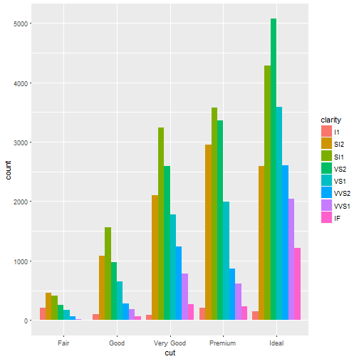

A reactive property map, made with Shiny, leaflet and plotly
========================================================
author: Spyros Marketos
date: 27/11/2016
autosize: true
transition: rotate

What can you do in the app?
========================================================

- Navigate the map, click through clusters of properties
- Get price for individual marker (property)
- Change the style of the map reactively
- Set the number of properties
- Set the range of the prices
- Explore the actual distribution of prices 
- Observe code execution as it happens


From ggplot2 to plotly (example)
========================================================


```r
library(tidyverse);library(plotly)
p <- ggplot(data = diamonds) + 
  geom_bar(mapping = aes(x = cut, fill = clarity), position = "dodge")
```


```r
ggplotly(p)
```



Using shiny, leaflet and plotly together
========================================================

- Shiny hosts the control widgets 

- Leaflet uses data interacting with Shiny's control widgets to generate the map

- plotly visualises the output of the interactions converting a ggplot2 object to an interactive visualisation


Conclusion and links
========================================================
Thanks for having a look! 

- You can see the app in action here:
https://spymark.shinyapps.io/reactive_leaflet/

- Here is the link to the github repo that contains all the code
https://github.com/spymark/data_products_proj

